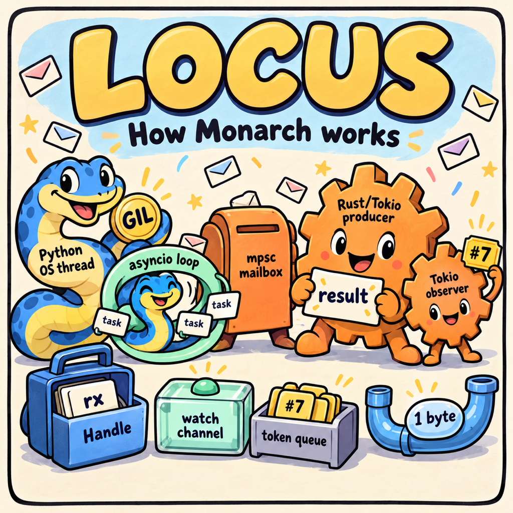

  

<h1 align="center">locus</h1>

  technical ideas, drawn out

`locus` is a small collection of illustrated explanations of how [Monarch](https://meta-pytorch.org/monarch/) works.

Read them at **[shayne-fletcher.github.io/locus](https://shayne-fletcher.github.io/locus/)**: one comic per page, with a permalink for each.

Each comic lives beside the prompt used to make it. The site is built by `site/build.py` from `site/comics.json`; to add a comic, add its image and prompt and append an entry there.

## Figures

- [Rust owns the mailbox, Python owns the loop](images/fig-1-python-actors.png) — [prompt](figures/fig-1-python-actors.md)
- [Who owns the thread?](images/fig-2-who-owns-the-thread.png) — [prompt](figures/fig-2-who-owns-the-thread.md)
- [How `handle.get()` wakes up](images/fig-3-1-handle-get.png) — [prompt](figures/fig-3-1-handle-get.md)
- [How `await handle` wakes the asyncio loop](images/fig-3-2-handle-asyncio.png) — [prompt](figures/fig-3-2-handle-asyncio.md)

## License

The comics, their prompts and the logo are © Shane Fletcher, licensed under [Creative Commons Attribution 4.0](LICENSE) (CC BY 4.0): share and adapt them freely, with credit. The site code (`site/` and `.github/`) is under the [BSD 3-Clause License](LICENSE-CODE).
