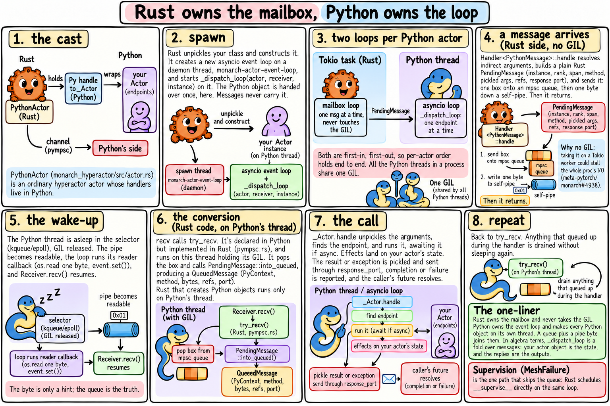
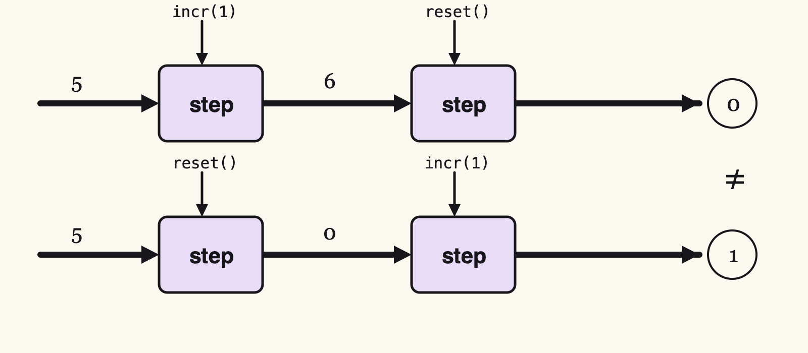

A Python actor in [Monarch](https://github.com/meta-pytorch/monarch) is two programs holding hands. Rust owns the mailbox. Python owns the loop. Here is the whole story on one page:



That's the map. The rest of this article zooms in, one idea at a time, and each idea comes with a picture and a little mathematics. The mathematics is there because it is the shortest way to say something true about the system. It also turns out to be lovely.

Source links are pinned to Monarch at [`d16adfd48`](https://github.com/meta-pytorch/monarch/tree/d16adfd48f71dadbdcf2c92c7a3d0054bd323ce2). *These are personal notes, not an official Monarch or Meta publication.*

## An actor is a step

Under all the machinery, a Monarch actor is one function.

Here is an actor:

```python
from monarch.actor import Actor, endpoint

class Counter(Actor):
    def __init__(self):
        self.n = 0

    @endpoint
    def incr(self, k: int) -> int:
        self.n += k
        return self.n
```

It has a **state** (`self.n`). It understands some **messages** (`incr(k)`). It answers each one with a **reply** (the new count). Name those three sets:

- $S$, the states the actor can be in,
- $M$, the messages it accepts,
- $R$, the replies it can give.

Then everything the actor does is one function:

$$ \mathsf{step} : S \times M \to S \times R $$

Read it aloud: *step takes a state and a message, and gives back a new state and a reply.* ($S \times M$ is just the set of pairs $(s, m)$.)


For `Counter`, $S = R = \mathbb{Z}$, and

$$ \mathsf{step}(n,\ \mathtt{incr}(k)) = (n + k,\ n + k). $$

This shape has a name. A machine whose output depends on both its state and its input is a **Mealy machine** (George Mealy, 1955). Every Monarch actor is one.

### Where the step lives

Monarch creates your object once, on a Python thread of its own, and it never moves. In Rust, a [`PythonActor`](https://github.com/meta-pytorch/monarch/blob/d16adfd48f71dadbdcf2c92c7a3d0054bd323ce2/monarch_hyperactor/src/actor.rs#L1066) holds a handle to it. Messages travel to the state; the state stays home.

### Why this matters

Everything else in this article is plumbing around `step`: getting $m$ to it, carrying $r$ back, deciding who calls it and on which thread. **`step` itself never changes.** Hold on to that. It is why, later on, a sync actor and an async actor turn out to be the same actor.

One honest caveat. Real endpoints do things — call other actors, move tensors, touch GPUs. So `step` is really "a computation that eventually yields a new state and a reply". The shape survives, and we'll sharpen it when effects start to matter.

### Check yourself

`incr` raises `ValueError`. Is that in $S$, $M$ or $R$?

<details><summary>Answer</summary>

$R$. An exception from an endpoint is a reply: Monarch pickles it and sends it to the caller, whose future fails with it.

</details>

### Going deeper

Curry the step. A function of two arguments is a function of one that returns a function:

$$ S \times M \to S \times R \quad\cong\quad S \to (M \to S \times R) $$

Read the right-hand side as: *a state is a menu* — for every message, what you'd become and what you'd say. Mathematicians call this a **coalgebra**, and it is the standard way to describe things you observe by poking, rather than build up from pieces.

## A run is a fold

An actor is a step: $\mathsf{step} : S \times M \to S \times R$. But an actor never gets just one message. So what is "the actor's state" after three?

Give `Counter` a second endpoint:

```python
    @endpoint
    def reset(self) -> int:
        self.n = 0
        return 0
```

Start where `__init__` leaves it, at $s_0$, and feed it messages one at a time. Each step hands its new state to the next:

$$
\begin{aligned}
(s_1, r_1) &= \mathsf{step}(s_0, m_1) \\
(s_2, r_2) &= \mathsf{step}(s_1, m_2) \\
(s_3, r_3) &= \mathsf{step}(s_2, m_3)
\end{aligned}
$$


The state runs along the wire. Messages drop in from above, replies fall out below. That's a **fold**: a computation that threads an accumulator through a sequence. This one also emits something at every step, so in Haskell it is called `mapAccumL`. In Python:

```python
def run(step, s, msgs):
    for m in msgs:
        s, r = step(s, m)
        yield r
```

Now look at Monarch's [dispatch loop](https://github.com/meta-pytorch/monarch/blob/d16adfd48f71dadbdcf2c92c7a3d0054bd323ce2/python/monarch/_src/actor/actor_mesh.py#L1398), with its batching stripped out:

```python
while True:
    msg = await receiver.recv()
    await _handle_queued_message(actor, msg)
```

It is the same loop. The state isn't passed along because it lives in `self`: **the actor object is the accumulator.**

The messages never end, so there is no "final" state. But every prefix has one, and that gives us the precise meaning of a phrase we use every day:

> At any moment, the actor's state is the fold of the messages handled so far.

### What the fold demands

**One at a time.** $s_2$ needs $s_1$. A step must finish before the next begins, and that's exactly why `_dispatch_loop` awaits each handler before it receives the next message.

**Order.** Run the same two messages both ways from $s_0 = 5$:

$$
\begin{aligned}
\mathtt{incr}(1),\ \mathtt{reset}() &:\quad 5 \to 6 \to 0 \\
\mathtt{reset}(),\ \mathtt{incr}(1) &:\quad 5 \to 0 \to 1
\end{aligned}
$$



Different end states. The order messages arrive in is part of what they *mean*. So somebody has to guarantee it — and that's where we go next.

### Check yourself

From $s_0 = 0$, `Counter` receives `incr(2)`, `incr(3)`, `reset()`, `incr(1)`. What are the replies, and what's the state afterwards?

<details><summary>Answer</summary>

Replies $2, 5, 0, 1$. State $1$.

</details>

### Going deeper

Why `mapAccumL` and not one of its cousins? `foldl` keeps only the final state. `scanl` keeps every state. An actor's caller sees neither: it sees the replies, and the state is private. `mapAccumL` is exactly that split — outputs out, state in.

<!-- To come, in order:
## Order            two FIFO hops; order-preserving maps compose
## Where code runs  every step labelled with its thread; Python objects only on the actor's thread
## The GIL is a token   invariants and induction; never on Tokio (#4938, #4991, pytokio removal)
## Waking up        happens-before; check-then-wait; wakes <= messages
## Two drivers      strip 2 whole; loop owns thread vs thread owns loop
## The same actor   observational equivalence for sync endpoints; what changes (supervision in the queue, get() without a helper thread)
## Afterword        the comics were diagrams
-->
