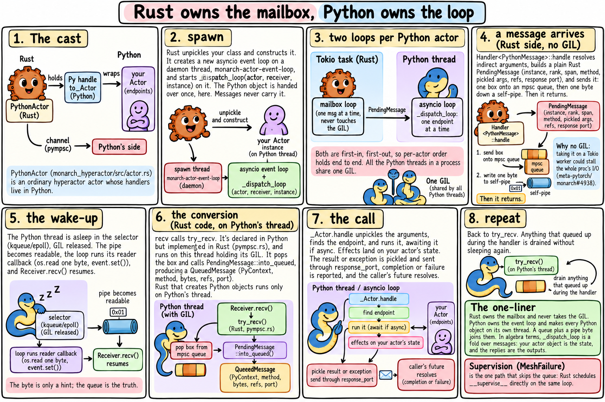

# The map

A Python actor in [Monarch](https://github.com/meta-pytorch/monarch) is two programs holding hands. Rust owns the mailbox. Python owns the loop. Here is the whole story on one page:

That is the map. The articles in this series zoom in, one idea at a time, and each idea comes with a picture and a little mathematics. The mathematics is there because it is the shortest way to say something true about the system — and, it turns out, it is lovely.

Each article stands alone. Source links are pinned to Monarch at [`d16adfd48`](https://github.com/meta-pytorch/monarch/tree/d16adfd48f71dadbdcf2c92c7a3d0054bd323ce2).

*These are personal notes, not an official Monarch or Meta publication.*
