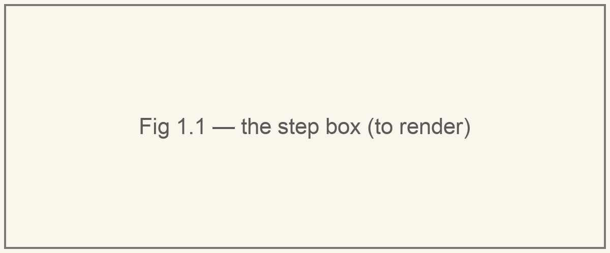

# An actor is a step

Under all the machinery, a Monarch actor is one function.

Here is an actor:

```python
from monarch.actor import Actor, endpoint

class Counter(Actor):
    def __init__(self):
        self.n = 0

    @endpoint
    def incr(self, k: int) -> int:
        self.n += k
        return self.n
```

It has a **state** (`self.n`). It understands some **messages** (`incr(k)`). It answers each one with a **reply** (the new count). Name those three sets:

- \\(S\\), the states the actor can be in,
- \\(M\\), the messages it accepts,
- \\(R\\), the replies it can give.

Then everything the actor does is one function:

\\[ \mathsf{step} : S \times M \to S \times R \\]

Read it aloud: *step takes a state and a message, and gives back a new state and a reply.* (\\(S \times M\\) is just the set of pairs \\((s, m)\\).)



For `Counter`, \\(S = R = \mathbb{Z}\\), and

\\[ \mathsf{step}(n,\ \mathtt{incr}(k)) = (n + k,\ n + k). \\]

This shape has a name. A machine whose output depends on both its state and its input is a **Mealy machine** (George Mealy, 1955). Every Monarch actor is one.

## Where the step lives

Monarch creates your object once, on a Python thread of its own, and it never moves. In Rust, a [`PythonActor`](https://github.com/meta-pytorch/monarch/blob/d16adfd48f71dadbdcf2c92c7a3d0054bd323ce2/monarch_hyperactor/src/actor.rs#L1066) holds a handle to it. Messages travel to the state; the state stays home.

## Why this matters

Everything else in this series is plumbing around `step`: getting \\(m\\) to it, carrying \\(r\\) back, deciding who calls it and on which thread. **`step` itself never changes.** Hold on to that. It is why, later on, a sync actor and an async actor turn out to be the same actor.

One honest caveat. Real endpoints do things — call other actors, move tensors, touch GPUs. So `step` is really "a computation that eventually yields a new state and a reply". The shape survives, and we'll sharpen it when effects start to matter.

## Check yourself

`incr` raises `ValueError`. Is that in \\(S\\), \\(M\\) or \\(R\\)?

<details><summary>Answer</summary>

\\(R\\). An exception from an endpoint is a reply: Monarch pickles it and sends it to the caller, whose future fails with it.

</details>

## Going deeper

Curry the step. A function of two arguments is a function of one that returns a function:

\\[ S \times M \to S \times R \quad\cong\quad S \to (M \to S \times R) \\]

Read the right-hand side as: *a state is a menu* — for every message, what you'd become and what you'd say. Mathematicians call this a **coalgebra**, and it is the standard way to describe things you observe by poking, rather than build up from pieces.

*Next: what happens when the messages keep coming.*
