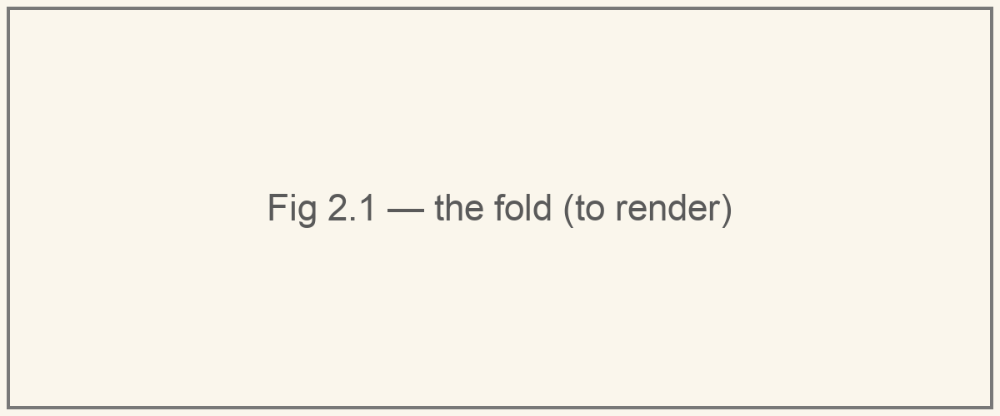
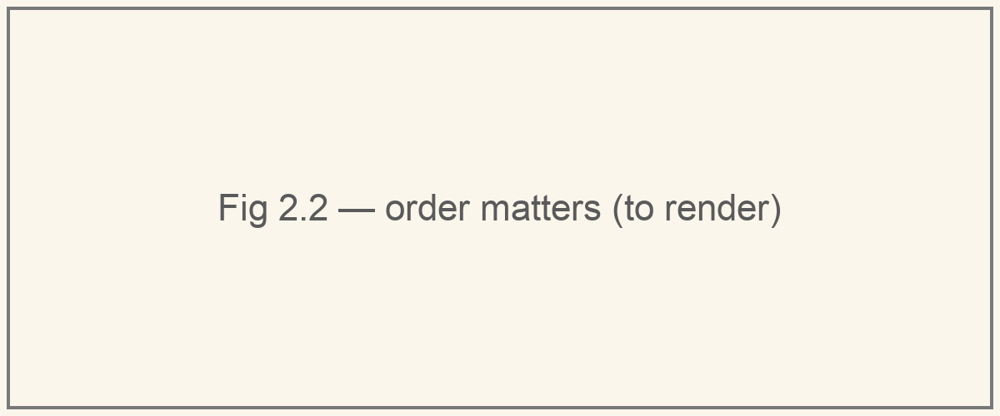

# A run is a fold

An actor is a step: \\(\mathsf{step} : S \times M \to S \times R\\). But an actor never gets just one message. So what is "the actor's state" after three?

Give `Counter` a second endpoint:

```python
    @endpoint
    def reset(self) -> int:
        self.n = 0
        return 0
```

Start where `__init__` leaves it, at \\(s_0\\), and feed it messages one at a time. Each step hands its new state to the next:

\\[
\begin{aligned}
(s_1, r_1) &= \mathsf{step}(s_0, m_1) \\\\
(s_2, r_2) &= \mathsf{step}(s_1, m_2) \\\\
(s_3, r_3) &= \mathsf{step}(s_2, m_3)
\end{aligned}
\\]



The state runs along the wire. Messages drop in from above, replies fall out below. That's a **fold**: a computation that threads an accumulator through a sequence. This one also emits something at every step, so in Haskell it is called `mapAccumL`. In Python:

```python
def run(step, s, msgs):
    for m in msgs:
        s, r = step(s, m)
        yield r
```

Now look at Monarch's [dispatch loop](https://github.com/meta-pytorch/monarch/blob/d16adfd48f71dadbdcf2c92c7a3d0054bd323ce2/python/monarch/_src/actor/actor_mesh.py#L1398), with its batching stripped out:

```python
while True:
    msg = await receiver.recv()
    await _handle_queued_message(actor, msg)
```

It is the same loop. The state isn't passed along because it lives in `self`: **the actor object is the accumulator.**

The messages never end, so there is no "final" state. But every prefix has one, and that gives us the precise meaning of a phrase we use every day:

> At any moment, the actor's state is the fold of the messages handled so far.

## What the fold demands

**One at a time.** \\(s_2\\) needs \\(s_1\\). A step must finish before the next begins, and that's exactly why `_dispatch_loop` awaits each handler before it receives the next message.

**Order.** Run the same two messages both ways from \\(s_0 = 5\\):

\\[
\begin{aligned}
\mathtt{incr}(1),\ \mathtt{reset}() &:\quad 5 \to 6 \to 0 \\\\
\mathtt{reset}(),\ \mathtt{incr}(1) &:\quad 5 \to 0 \to 1
\end{aligned}
\\]



Different end states. The order messages arrive in is part of what they *mean*. So somebody has to guarantee it — and that's the next article.

## Check yourself

From \\(s_0 = 0\\), `Counter` receives `incr(2)`, `incr(3)`, `reset()`, `incr(1)`. What are the replies, and what's the state afterwards?

<details><summary>Answer</summary>

Replies \\(2, 5, 0, 1\\). State \\(1\\).

</details>

## Going deeper

Why `mapAccumL` and not one of its cousins? `foldl` keeps only the final state. `scanl` keeps every state. An actor's caller sees neither: it sees the replies, and the state is private. `mapAccumL` is exactly that split — outputs out, state in.

*Next: where the order comes from.*
